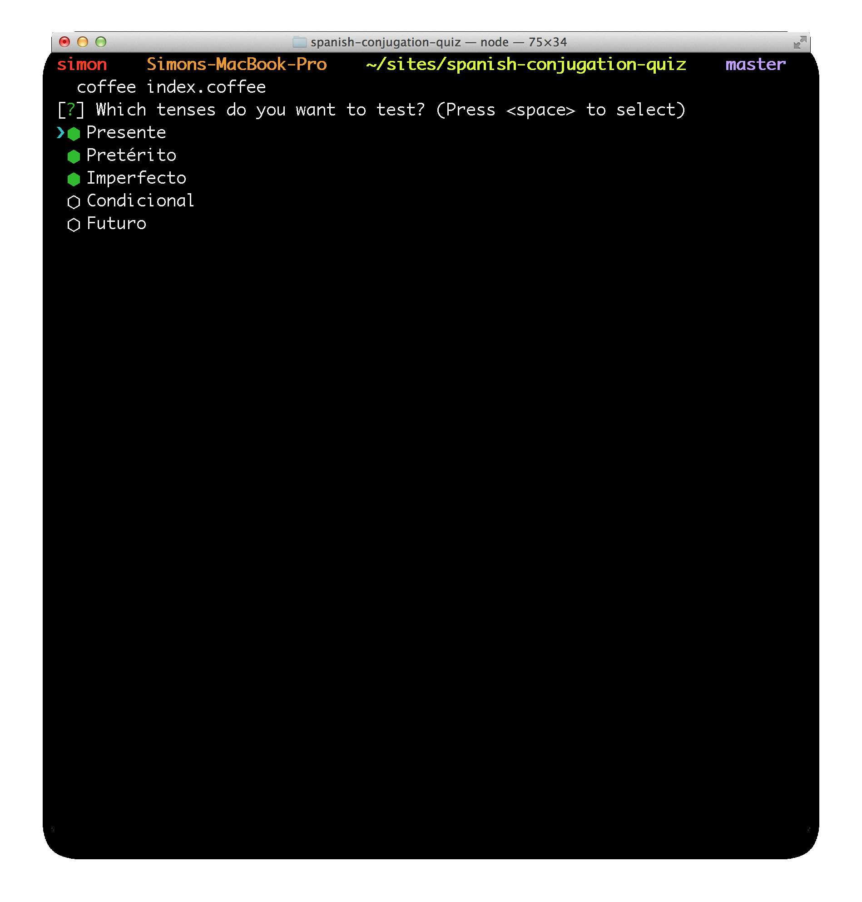

# Spanish Quiz

Nothing like duolingo. This is just a quiz game for practicing conjugating verbs:

Web version available here: http://captainclam.github.io/spanish-conjugation-quiz/

Command line version requires download: (see Installation below)




## Installation
```
git clone git@github.com:captainclam/spanish-conjugation-quiz.git
cd spanish-conjugation-quiz
npm install
npm start
```

## Usage

You will be prompted to choose what you want to study. Currently there's only 100 verbs, but with 6 prefixes and 5 tenses that's about 3000 conjugations to practice.

Type `exit` to quit the program.


## Web Client

To launch the web version locally, go:

```
cd www
server
```

To dev on the web version, do: `grunt watch` and it will live reload style/script changes


## Updating the dictionary

Edit the file `verbs`, and add to the list of verbs (in their infinitive form).

Run `fetch.coffee` and pipe the output to the dictionary (e.g. `coffee fetch.coffee >> data`).

Note if you get some bad/empty responses from spanishdict.com you may need to run the command again. It will only add new entries to the dictionary for verbs that have not already been fetched, so there is no harm in running it multiple times.


## TODO / Ideas

- Conjugation tables for hints
- Highlight irregular verbs
- Scrape english translation of the infinitive
- Remove livereload in prod
